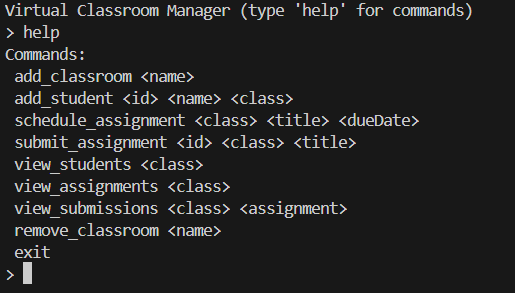
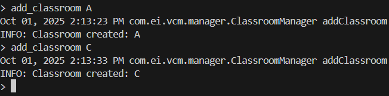
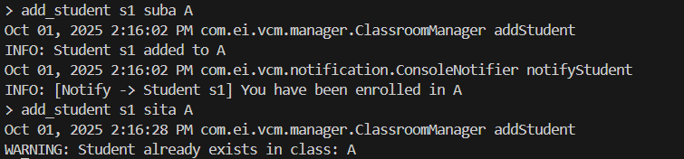
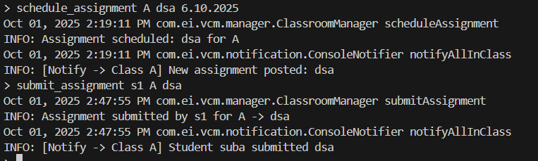
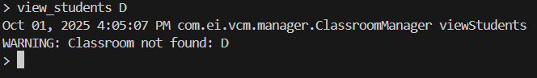
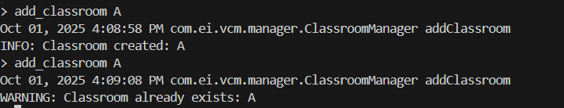
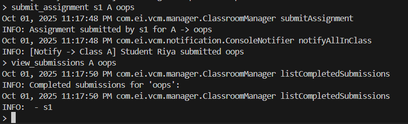

 Virtual Classroom Manager  

📌 Overview  
The Virtual Classroom Manager is a terminal-based Java application that simplifies managing virtual classrooms.  
Educators can create classrooms, enroll students, assign homework, track submissions, and send notifications — all built with clean software engineering practices.  

This project highlights:  
- Use of Design Patterns (Singleton, Factory, Observer-style)  
- Application of SOLID Principles
- Modular structure with clear package separation  
- Custom exceptions & logging for robustness  

---

 🎯 Features  

 🏫 Classroom Management  
- Create and remove classrooms  
- View list of all classrooms  

 👩‍🎓 Student Enrollment  
- Enroll students into classrooms  
- Prevent duplicate entries  
- View students in a classroom  

 📑 Assignment Management  
- Schedule assignments with deadlines  
- Submit assignments by students  
- Track submission status (NEW)

 📢 Notifications  
- Notify students when enrolled  
- Broadcast assignment updates to the whole class  

 🛡️ Error Handling & Logging  
- Custom Exceptions: `EntityNotFoundException`, `ValidationException`  
- Logging: Key actions logged using `java.util.logging`  

---

 🧩 Design Patterns  

1. Singleton – `ClassroomManager` ensures only one instance manages the system.  
2. Factory – `EntityFactory` centralizes creation of `Classroom`, `Student`, and `Assignment`.  
3. Observer-style – `Notifier` & `ConsoleNotifier` decouple notifications from core logic, allowing future extension (e.g., Email/SMS).  

---

 🧩 SOLID Principles in Action  

- S – Single Responsibility: Each class (`Student`, `Classroom`, etc.) has one role.  
- O – Open/Closed: Extend with new notifiers or features without changing core logic.  
- L – Liskov Substitution: Any `Notifier` implementation can replace another seamlessly.  
- I – Interface Segregation: Lean `Notifier` interface.  
- D – Dependency Inversion: High-level modules depend on abstractions, not details. 
 
java -cp bin com.ei.vcm.App
1. Start the Application
Command to run:
java -cp src com.ei.vcm.manager.App
Description: Launches the Virtual Classroom Manager in the terminal.
Execution Snapshot:

2. Create a New Classroom
Action: Enter classroom details 
Execution Snapshot:

3. Enroll Students
Action: Add students to the created classroom.

Execution Snapshot:

4. Schedule Assignments
Action: Add assignments with deadlines.

Execution Snapshot:

5. Listing Classrooms When No Classrooms Are Available

Action: Try to view all classrooms when none exist.

Execution Snapshot:

6. Duplicate Classroom Creation

Action: Try creating a classroom with the same name twice.

Execution Snapshot:

7. Tracking Assignments

Action: Track the students who completed the assignment.

Execution Snapshot: